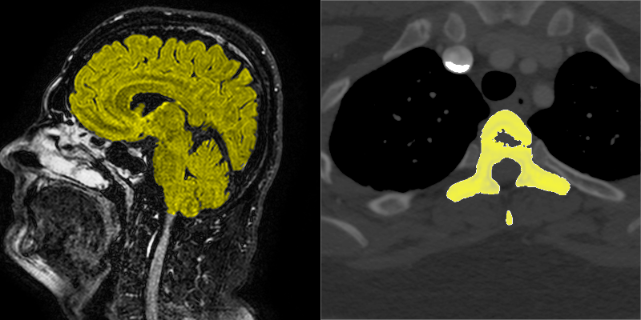
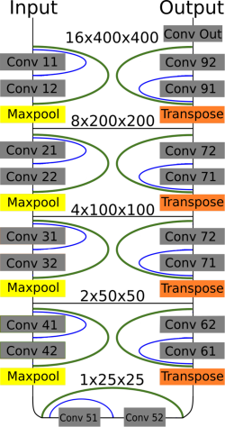
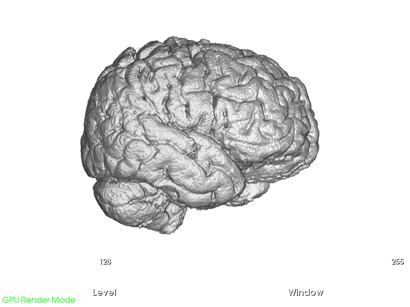
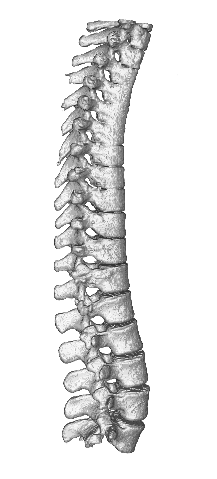

# Optimized High Resolution 3D Dense-U-Net Network for Brain and Spine Segmentation
Hello everyone, this is a repository containing code to Paper "Optimized High Resolution 3D Dense-U-Net Network for Brain and Spine Segmentation" published at MDPI Applied sciences journal - https://www.mdpi.com/2076-3417/9/3/404 .

The code is intentionally written in simple script like not OOP style to keep as simple as possible.

Most useful parts of this repository are python keras scripts with source code for 2D and 3D Dense-U-Net network models. Its an upgraded U-Net that we obtained better results than with classic U-Net and current hardware is capable of fitting it into GPU memory. 3D and 2D versions of Dense-U-Net, Res-U-Net and classic U-Net implementations are included. Happy experimenting and let me know if any of your work is inspired by our work :) !

## Overview

    
<b>Figure_1:</b> Example of MRI sagitall brain scan slice and transversal thoracic CT scan slice - tissue segmented with 3D-Dense-U-Net is highlighted in yellow.

    
<b>Figure_2:</b> Dense-U-net network model. Residual interconnections are in green color, dense interconnections in blue.

    
<b>Figure_3:</b> Brain model segmented from MRI set of images by 3D-Dense-U-Net.

    
<b>Figure_4:</b> Spine model segmented from CT set of images by 3D-Dense-U-Net. The abnormal vertebrae adhesions exist also in original ground truth masks.

## Citation and references

Please cite our work as:

Kolařík, M., Burget, R., Uher, V., Říha, K., & Dutta, M. K. (2019). Optimized High Resolution 3D Dense-U-Net Network for Brain and Spine Segmentation. Applied Sciences, 9(3), vol. 9, no. 3. 

Article{kolarik2019optimized, 
&nbsp;   &nbsp;  title={Optimized High Resolution 3D Dense-U-Net Network for Brain and Spine Segmentation}, 
&nbsp;   &nbsp;  author={Kola{\v{r}}{\'\i}k, Martin and Burget, Radim and Uher, V{\'a}clav and {\v{R}}{\'\i}ha, Kamil and Dutta, Malay Kishore}, 
&nbsp;   &nbsp;  journal={Applied Sciences},  
&nbsp;   &nbsp;  volume={9}, 
&nbsp;   &nbsp;  number={3}, 
&nbsp;   &nbsp;  pages={404}, 
&nbsp;   &nbsp;  year={2019}, 
&nbsp;   &nbsp;  publisher={Multidisciplinary Digital Publishing Institute}  
}

The Code is inspired by great repository [Deep Learning Tutorial for Kaggle Ultrasound Nerve Segmentation competition, using Keras](https://github.com/jocicmarko/ultrasound-nerve-segmentation)
The Dense-Unet architecture was inspired by papers [The One Hundred Layers Tiramisu: Fully Convolutional DenseNets for Semantic Segmentation](https://arxiv.org/pdf/1611.09326.pdf) and [Densely Connected Convolutional Networks](https://arxiv.org/pdf/1608.06993.pdf).
The original U-Net architecture was inspired by paper [U-Net: Convolutional Networks for Biomedical Image Segmentation](http://lmb.informatik.uni-freiburg.de/people/ronneber/u-net/).

## About Keras

Keras is a minimalist, highly modular neural networks library, written in Python and capable of running on top of either TensorFlow or Theano. It was developed with a focus on enabling fast experimentation. Being able to go from idea to result with the least possible delay is key to doing good research.

Use Keras if you need a deep learning library that:

allows for easy and fast prototyping (through total modularity, minimalism, and extensibility).
supports both convolutional networks and recurrent networks, as well as combinations of the two.
supports arbitrary connectivity schemes (including multi-input and multi-output training).
runs seamlessly on CPU and GPU.
Read the documentation [Keras.io](http://keras.io/)

Keras is compatible with: Python 2.7-3.5.
